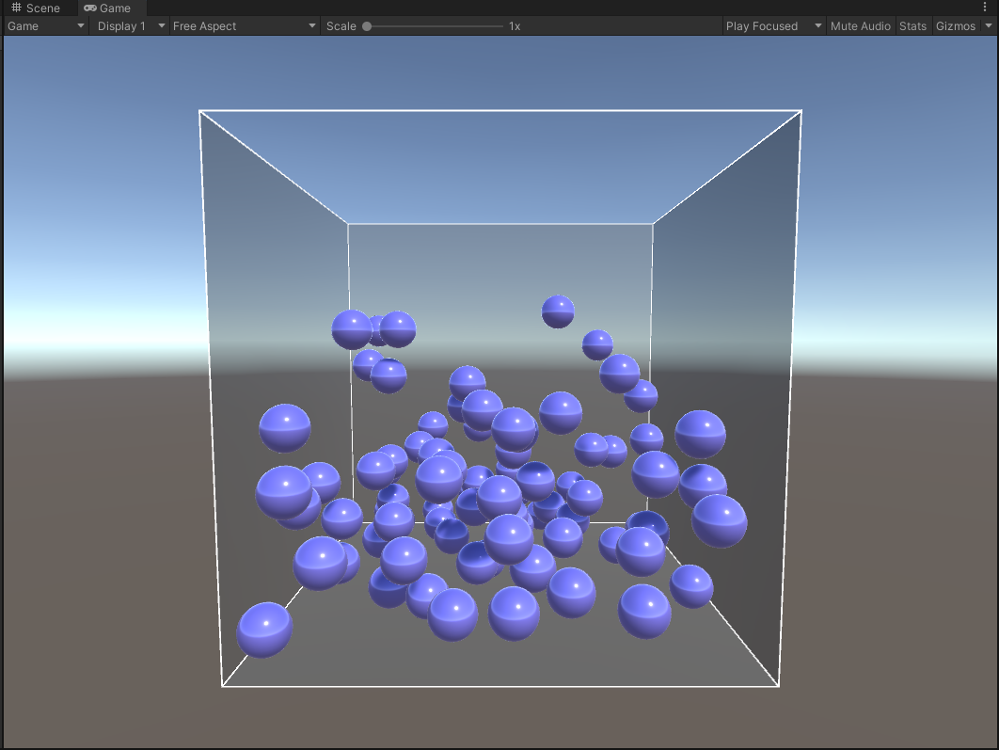

# vaja03_ParticleSystem
C# unity implementation of particle effects, using solid particle collisions and magnetically repelling bodies collisions. Engine used only for rendering, collision and physics logic coded manually.

## Preview

